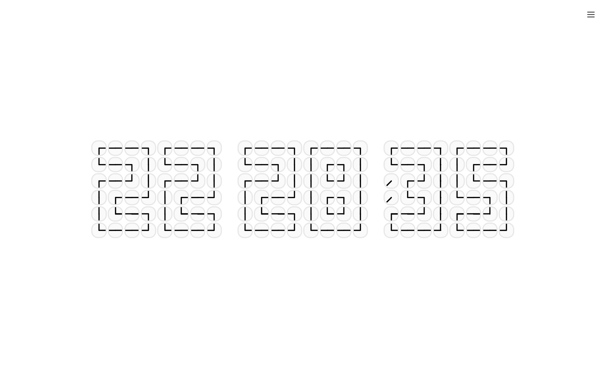
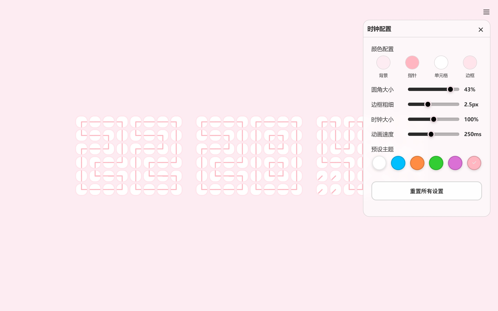

# 时钟组成的时钟

一个创意时钟项目，使用小时钟的指针角度来拼出数字，显示当前时间。

## 效果预览





## 使用方法

1. 直接用浏览器打开 `index.html` 文件即可
2. 或者使用任意 HTTP 服务器托管这些文件

### 使用 Python 快速启动（可选）

```bash
# Python 3
python -m http.server 8000
# 然后在浏览器访问 http://localhost:8000
```

### 使用 VS Code Live Server（可选）

1. 安装 Live Server 扩展
2. 右键点击 `index.html`
3. 选择 "Open with Live Server"


## 自定义配置

点击页面右上角的 **菜单按钮** 可以打开配置面板，支持丰富的自定义选项：

### 颜色配置

- **背景颜色**：页面背景色
- **指针颜色**：时钟指针的颜色
- **单元格颜色**：时钟单元格的背景色
- **边框颜色**：时钟单元格的边框颜色

### 样式调节

- **圆角大小**：0-50%，调节时钟单元格的圆角程度
  - 0% = 完全方形
  - 50% = 完全圆形
- **边框粗细**：1-5px，调节单元格边框的粗细
- **时钟大小**：50-150%，整体缩放时钟尺寸
- **动画速度**：50-500ms，指针旋转的动画时长

### 预设主题

提供 6 个精心设计的预设主题，一键切换：

- **默认**：经典黑白配色
- **海洋**：深海蓝色调
- **日落**：温暖的橙红色系
- **森林**：清新的绿色主题
- **霓虹**：炫酷的紫色科技感
- **梦幻**：浪漫的粉色系

### 重置功能

点击 **重置** 按钮可以将所有配置恢复到默认主题。

### 自动保存

所有配置会自动保存在浏览器本地存储中，下次打开页面时会自动加载您的个性化设置。


## 技术原理

### 数字显示原理

每个数字（0-9）由 **24个小时钟单元** 组成，排列成 **4列 × 6行** 的网格。

每个时钟单元包含：
- 2个指针（通过旋转角度表示线段）
- 1个中心点

通过控制指针的角度，可以形成不同的线段形状：
- `┌` 左上角：[0°, 90°]
- `┐` 右上角：[90°, 180°]
- `└` 左下角：[0°, 270°]
- `┘` 右下角：[180°, 270°]
- `-` 横线：[0°, 180°]
- `|` 竖线：[90°, 270°]
- ` ` 空白：[135°, 135°]

### 核心组件

1. **DOM工具类**：封装 DOM 操作
2. **指针组件**：管理单个指针
3. **时钟单元组件**：包含两个指针的单元格
4. **数字显示组件**：4×6网格显示单个数字
5. **数字对组件**：显示两位数字（如小时）
6. **时钟主体组件**：完整的时:分:秒显示
7. **时钟应用类**：主应用逻辑

## 许可证

MIT License

## 原作者
原作者：EntropyReversed
原项目地址：https://www.reddit.com/r/webdev/comments/1nrx5n9/clock_made_of_clocks/